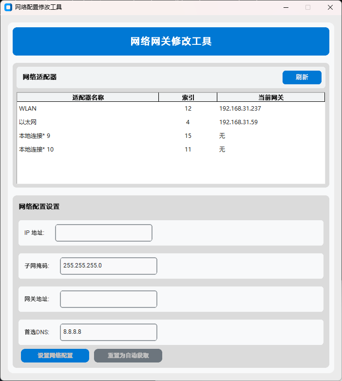

# GatewayChanger

## 产品预览

## ✨ 功能

- 设置网络IP地址
- 设置网络子网掩码
- 设置网络网关地址
- 设置网络首选DNS

## 🚀 快速开始

### 方式1: 直接使用EXE（推荐）

[Releases](https://github.com/shengyexiuyo/GatewayChanger/releases)中下载最新exe文件，双击打开使用。

### 方式2: 使用.bat启动项目

双击使用launch_gui.bat，启动项目GUI界面，需要电脑安装python环境。

## ⚠️ 免责声明

本项目仅供学习和研究使用，作者不对使用本项目产生的任何损失负责。
